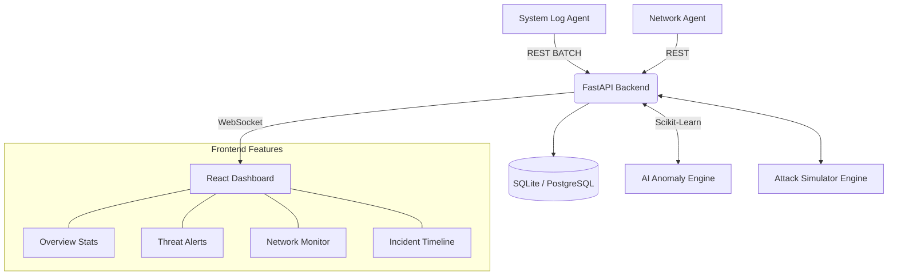

# AI-SIEM Guardian
**Lightweight AI-powered Cybersecurity Monitoring Platform**

AI-SIEM Guardian is a production-like, modular, and locally runnable Security Information and Event Management (SIEM) system. It mimics the core features of enterprise SIEM tools (like Elastic SIEM or Splunk) but remains entirely open-source and lightweight.

## Features

- **Real-time Log Collection**: Dedicated agents generate and collect system logic, syncing them to the backend even after offline periods.
- **Network Traffic Analysis**: Scapy-based network monitoring (with built-in simulation fallback for systems without raw socket access) tracks suspicious IPs and port activity.
- **AI Anomaly Detection**: Uses scikit-learn's Isolation Forest to detect anomalous login patterns, high-frequency access, and credential stuffing.
- **Attack Simulation Engine**: Built-in simulator to trigger brute-force, port scanning, credential stuffing, and geo-anomaly attacks for testing the defense capabilities.
- **Cybersecurity Dashboard**: A professional, dark-themed React + Vite dashboard featuring Recharts visualizations, real-time WebSocket alert toasts, and unified threat timelines.
- **Actionable Alerts**: Generates alerts with varying severities and broadcasts them instantly to all connected analysts.
- **Normalized Security Events**: Stores agent and simulator telemetry in a canonical, queryable event model alongside the original logs.
- **Database Guardian API**: Registers SQLite and PostgreSQL assets with encrypted credentials, connection checks, health status, alerts, and risk scores.

## Architecture

## Quick Start (Docker)

The fastest way to get started is using Docker Compose, which spins up the backend, frontend, PostgreSQL database, and log/network agents.

1. Clone or download the repository.
2. Copy `.env.example` to `.env` and set `POSTGRES_PASSWORD`, `JWT_SECRET_KEY`, `AGENT_API_KEY` and
   `DB_ENCRYPTION_KEY` (a Fernet key; the backend refuses to start without a valid one — see `.env.example`)
   (Compose refuses to start without them).
3. Set `SKYLOS_BOOTSTRAP_ADMIN_USERNAME`, `SKYLOS_BOOTSTRAP_ADMIN_EMAIL` and
   `SKYLOS_BOOTSTRAP_ADMIN_PASSWORD` in `.env` for the first start (or run
   `docker compose exec backend python manage.py create-admin --username <name> --email <email>`).
4. Run `docker compose up --build -d`
5. Access the dashboard at `http://localhost:80` (or `http://localhost:5173` if running locally).

> Skylos ships **no default administrator**. Older versions created `admin` / `admin123`;
> accounts still using that password are refused at login and must be reset with
> `python manage.py reset-password <username>`. New user accounts are created by an
> administrator (`POST /api/auth/register` is admin-only).

> **Verification status:** Docker Compose configuration validates (`docker compose config`),
> but the full stack has not yet been started in a Docker environment. See `PROJECT_PROGRESS.md`.

## Database Migrations

The schema is managed by Alembic (`backend/migrations/`). The backend applies pending
migrations automatically at startup; the database URL comes from `DATABASE_URL`.

- **New database:** the full schema is created.
- **Database created by an older version (before migrations):** existing tables and data are
  kept, missing tables/indexes are added, and the database is upgraded to the current migration head.
  If an existing table lacks a required column, startup stops with an explanation and makes no changes.
- **Back up before upgrading** (SQLite: copy the `.db` file while the backend is stopped).
  Downgrading below the baseline is not supported; restore the backup instead.

Manual commands (from `backend/`): `alembic current`, `alembic upgrade head`.
After changing `models.py`, create a migration with `alembic revision --autogenerate -m "<change>"`,
review it, and run the tests — `tests/test_migrations.py` fails if models and migrations differ.

> Run a single backend process when upgrading: two processes starting at the same time could
> both attempt the same migration. PostgreSQL upgrades have not yet been verified (see `PROJECT_PROGRESS.md`).

## API highlights

- `GET /api/events/` lists normalized events. It requires a bearer token and accepts `skip`, `limit`, `event_type`, `source_type`, `since`, and `until` filters.
- Agent log ingestion remains at `POST /api/logs/ingest` and `POST /api/logs/ingest/batch`; accepted records are also written to `security_events` in the same transaction.
- Database Guardian endpoints are under `/api/databases/`. Administrators can register and update SQLite or PostgreSQL assets; administrators and analysts can check a registered connection. Passwords are never returned by the API.
- The WebSocket endpoint is `/ws?token=<JWT>`. The dashboard supplies the token and maintains the connection across its pages.

The event model and Database Guardian endpoints are an initial vertical slice. Per-agent identity,
incident management, key rotation, full database telemetry, and the desktop client remain unfinished.

## Local Development Setup

Please refer to [`SETUP_GUIDE.txt`](./SETUP_GUIDE.txt) for comprehensive step-by-step instructions on installing required tools (Python, Node.js, Npcap) and running the components locally without Docker.

## Project Structure

- `backend/`: FastAPI application, database models, AI engine, alert service, and Websocket manager.
  - `agent/`: Python scripts for generating system logs and triggering network captures.
- `frontend/`: React + Vite + TypeScript application with TailwindCSS v4 styling.
- `dataset/`: Contains `sample_logs.json` for testing the ML model structure.
- `docker-compose.yml`: Orchestrates the entire stack for simple deployment.

## Simulation & Testing

Once logged into the dashboard, navigate to the **Threat Alerts** page and click the red **Simulate Attack** button. This will trigger the backend's `attack_simulator.py` to inject malicious traffic, which will then trigger the AI Anomaly Engine, generate real alerts, and push them to your dashboard in real-time.
